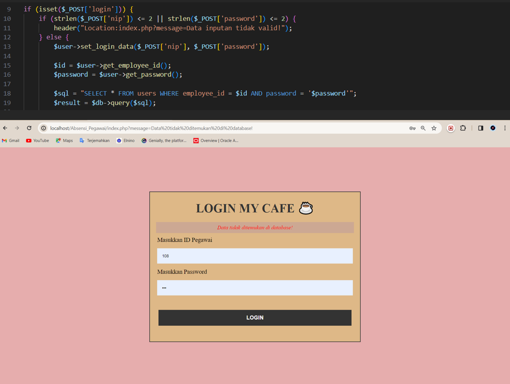
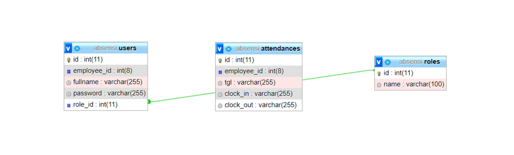

# Employee Attendance Web Application

This repository contains the final project report for the **Dynamic Web Programming** course. The original source code is no longer available, but this README summarizes the core features and design based on the final report.

---

## 📘 Project Overview

This web application was developed as a solution for managing **employee attendance** in a workplace. The system provides both employee and admin access with different roles and features.

---

### 👤 **Employee Interface**
- Login with unique ID and password
- Clock-in (absen masuk) and clock-out (absen pulang)
- View personal profile

### 🛠️ **Admin Interface**
- Monitor employee attendance down to the second
- Add, edit, or delete employee records
- Manage job roles (roles/pekerjaan)
- Add or remove job roles
- View and edit employee profiles

## 🧑‍💼 Screenshots
### Login interface
  
### Pegawai interface
  .png)
### Admin interface 
 - Pegawai Data
   
 - Pegawai Profile
   
 - Edit Pegawai
   
 - Delete Pegawai
   
 - Add Pegawai
   
 - List Role
   
 - Add/Delete Role
   
### ERD
 - 
 
---

## 🗃️ Database Design

The application includes an **Entity Relationship Diagram (ERD)** to represent database structure, focusing on employees, roles, and attendance records.

---

## 🧾 Conclusion

This attendance web system allows employees to record their working hours securely and lets admins monitor employee presence accurately. It is especially useful for store managers or business owners who want a precise and real-time employee tracking solution.

---

## 👨‍🎓 Project Information

- **Student:** Akasha Bin Ali  
- **ID:** 4.33.22.0.01  
- **Class:** TI - 2A  
- **Lecturer:** Wiktasari, S.T., M.Kom.  
- **Course:** Dynamic Web Programming  
- **Institution:** Politeknik Negeri Semarang  
- **Department:** Electrical Engineering

---

## 📎 Additional Notes

Due to file loss, the original application source code is not included in this repository. Only the final report (`.docx`) is provided as documentation of the project scope and functionality.

